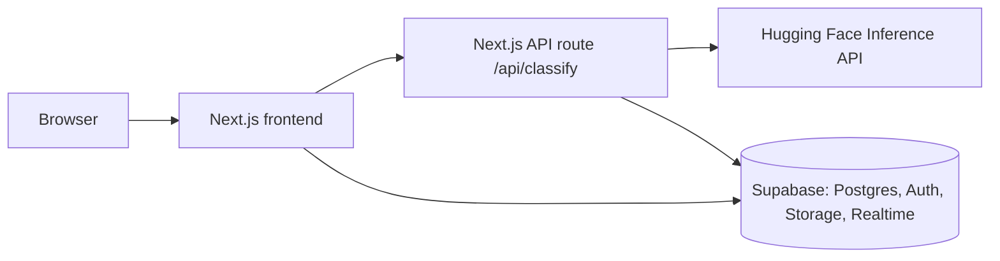
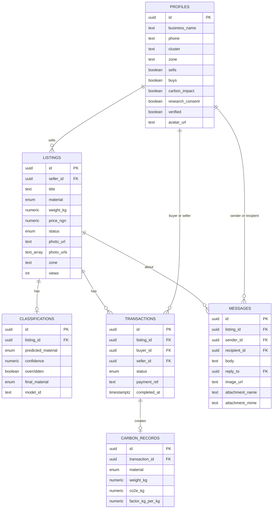

# EcoLoop

AI-powered marketplace that helps factories in Lagos sell their scrap and surplus materials to other factories nearby, instead of dumping them.

## Video Demo

PASTE-YOUR-VIDEO-LINK-HERE (Google Drive or YouTube unlisted, set to "Anyone with the link can view")

## Description

Small and medium manufacturers in the Ogba and Ikeja industrial clusters in Lagos throw away offcuts, scrap, and by-products that other factories could use as raw material. EcoLoop connects them.

A seller takes a photo of their surplus material. An AI model classifies it (Plastic, Glass, Metal, Biodegradable, or Rubber), the seller can override the result, and the listing goes live in the marketplace. Buyers search and filter by material and distance, message the seller, reserve the lot, and mark the exchange as complete. Every completed exchange records how much CO2e (carbon) was kept out of landfill.

**This first version (MVP) includes:**

- Sign up, log in, forgot password, and company profile (with photo)
- Quick listing flow: upload photo, AI classification with manual override, publish
- Marketplace with search, material filters, distance filter, and verified sellers
- Messaging between buyer and seller, with file attachments and live updates
- Transactions: interest, reserved, completed
- Carbon impact tracking and a dashboard
- My listings page with manage, edit, add photos, and delete

**GitHub repository:** https://github.com/YOUR-USERNAME/YOUR-REPO

## Tech Stack

| Layer | Tool | Why I chose it |
|-------|------|----------------|
| Frontend | Next.js 16, React 19, TypeScript | File-based routing gives clear pages and navigation. TypeScript catches mistakes early. |
| Styling | Tailwind CSS 4 and custom CSS, IBM Plex Sans and Mono | A consistent design system through CSS variables, easy responsive breakpoints. |
| Backend | Next.js API routes (`app/api/classify`) | One project for frontend and backend, simple to run and deploy. |
| Database | Supabase (PostgreSQL) | Hosted database with row level security, so users only see what they should. |
| Auth | Supabase Auth | Secure login and password reset without building it from scratch. |
| File storage | Supabase Storage | Buckets for listing photos, chat attachments, and profile pictures. |
| AI | Hugging Face Inference (`yangy50/garbage-classification`, fallback `google/vit-base-patch16-224`) | Pretrained models, so no training is needed. Labels are mapped into 5 EcoLoop categories. |
| Realtime | Supabase Realtime | New messages show up without refreshing. |
| Deployment (planned) | Vercel and Supabase | Free tiers, deploys automatically from GitHub. |

### Architecture



### Scope of this MVP

**In scope:** auth, profiles, listings, AI classification with override, marketplace filters, messages, transactions, carbon impact.

**Out of scope (later):** in-app payments, logistics partners, smart pricing, a chatbot, and training a custom model from scratch. After a lot is reserved, buyer and seller share payment details and proof in Messages, then mark the exchange completed.

### How the AI classification works

1. The seller uploads a photo, which is stored in Supabase Storage.
2. The API route sends the photo URL to Hugging Face. It tries `yangy50/garbage-classification` first.
3. If that model is not available on the free tier, it falls back to `google/vit-base-patch16-224` and maps its labels into the 5 EcoLoop categories (for example "beer bottle" becomes Glass and "water bottle" becomes Plastic).
4. Results under 60% confidence are flagged for review, and the seller can always override the category.

## Setup Instructions

### Requirements

- Node.js 20 or newer
- Git
- A free Supabase account: https://supabase.com
- A free Hugging Face account and access token: https://huggingface.co/settings/tokens

### 1. Clone the project

```bash
git clone https://github.com/YOUR-USERNAME/YOUR-REPO.git
cd YOUR-REPO
```

### 2. Install packages

```bash
npm install
```

### 3. Set up Supabase

1. Create a new project on supabase.com.
2. Open **SQL Editor** and run each file in `supabase/migrations/` in number order, from `001` to `013`.
3. Open **Table Editor** and check that these tables exist: `profiles`, `listings`, `classifications`, `transactions`, `carbon_records`, `messages`.
4. Open **Storage** and check that these buckets exist: `listing-photos`, `message-attachments`, `profile-avatars`.
5. Open **Project Settings, API** and copy the Project URL and the anon key.

### 4. Add environment variables

Copy the example file:

```bash
cp .env.example .env.local
```

On Windows PowerShell use `Copy-Item .env.example .env.local`.

Then fill in `.env.local`:

| Variable | What it is for |
|----------|----------------|
| `NEXT_PUBLIC_SUPABASE_URL` | Your Supabase project URL |
| `NEXT_PUBLIC_SUPABASE_ANON_KEY` | Your Supabase anon (public) key |
| `PROJECT_URL` | Same as the Supabase URL, used to check image URLs on the server |
| `HF_TOKEN` | Your Hugging Face access token |
| `HF_MODEL_ID` | `yangy50/garbage-classification` |

Never commit `.env.local`. It is already in `.gitignore`.

### 5. Allow the password reset link

In Supabase go to **Authentication, URL Configuration** and add this redirect URL:

```
http://localhost:3000/reset-password
```

### 6. Run the app

```bash
npm run dev
```

Open http://localhost:3000, create an account, and you are ready to test.

### Other commands

| Command | What it does |
|---------|--------------|
| `npm run build` | Production build |
| `npm start` | Run the production build |
| `npm run lint` | Check code with ESLint |

## Project Structure

```
app/                   Pages (App Router), API route, global styles
components/            UI by area: home, dashboard, marketplace, listings, messages, profile
lib/                   Supabase client, listings, messages, transactions, classify, carbon helpers
supabase/migrations/   SQL files that build the database (001 to 013)
public/assets/         Logo and sample listing images
docs/                  Screenshots and designs
```

## Designs

### Screenshots of the app

**Home page**


**Dashboard**


**Marketplace**


**Quick listing (3 steps: photo, AI check, publish)**


### Figma mockups

Figma link: PASTE-YOUR-FIGMA-LINK-HERE


### Database diagram


### Style guide

| Item | Value |
|------|-------|
| Heading and body font | IBM Plex Sans |
| Numbers and labels font | IBM Plex Mono |
| Background | `#f4f3ef` (warm off white) |
| Text | `#16191a` |
| Muted text | `#6f6e65` |
| Dark header | `#14181a` |
| Primary green | `oklch(0.46 0.11 155)` |
| Accent amber | `oklch(0.72 0.13 72)` |
| Corner radius | 14px cards, 9px small elements |

Design choices:

- **Two bars at the top.** A dark header holds the logo and account. A white bar below it holds the main navigation: Home, Dashboard, Marketplace, Quick listing, My listings, Messages. The current page is underlined in green.
- **Green means action.** Main buttons ("Initiate contact", "Publish", "New listing") are green. Secondary buttons are outlined.
- **Quick listing is a 3 step flow** with a timer, because the goal is to list material in under 60 seconds.
- **Labels on cards** show the AI category, confidence, weight, distance, asking price, and CO2e saved so buyers can decide quickly.

## Frontend Code Highlights

**Responsive design.** Media queries in `app/globals.css` simplify the header and navigation on small screens:

```css
@media (max-width: 720px) {
  .app-header { padding: 0 16px; }
  .app-user-meta { display: none; }
  .app-nav { padding: 0 12px; }
}
```

**Navigation defined in one place.** `lib/navigation.ts` holds the links, and the nav component renders them:

```ts
export const NAV_LINKS = [
  { href: "/", label: "Home" },
  { href: "/dashboard", label: "Dashboard" },
  { href: "/marketplace", label: "Marketplace" },
  { href: "/listings/new", label: "Quick listing" },
  { href: "/listings/mine", label: "My listings" },
  { href: "/messages", label: "Messages" },
  { href: "/impact", label: "Carbon impact", feature: "carbonImpact" as const },
] as const;
```

**State handling in the quick listing flow** (`components/listings/QuickListingPage.tsx`). React state tracks the upload, the AI result, the manual override, and the publish step:

```tsx
const [stage, setStage] = useState<Stage>("idle");
const [aiLabel, setAiLabel] = useState<MaterialCategory>("Metal");
const [aiConfidence, setAiConfidence] = useState(0);
const [override, setOverride] = useState<MaterialCategory>("Metal");
const [overridden, setOverridden] = useState(false);
const [publishing, setPublishing] = useState(false);
```

## Backend Code Highlights

**API endpoint** (`app/api/classify/route.ts`). It validates the request, checks that the image comes from our own Supabase storage, then calls the classifier:

```ts
export async function POST(request: Request) {
  let body: Body;
  try {
    body = (await request.json()) as Body;
  } catch {
    return NextResponse.json({ error: "Invalid JSON body" }, { status: 400 });
  }

  const imageUrl = body.imageUrl?.trim();
  if (!imageUrl) {
    return NextResponse.json({ error: "imageUrl is required" }, { status: 400 });
  }
  // ...host check against NEXT_PUBLIC_SUPABASE_URL / PROJECT_URL...
  const result = await classifyListingImage(imageUrl);
  return NextResponse.json(result);
}
```

**Server-side logic: carbon calculation** (`lib/carbon.ts`). Each material has a CO2e factor per kg:

```ts
export const CO2: Record<MaterialCategory, number> = {
  Metal: 4.2,
  Plastic: 1.9,
  Glass: 0.6,
  Biodegradable: 0.9,
  Rubber: 2.4,
};

export function co2FromWeight(weight: number, material: MaterialCategory): number {
  return Math.round(weight * (CO2[material] ?? 1));
}
```

**Distance between buyer and seller** (`lib/listings.ts`) uses the haversine formula:

```ts
export function haversineKm(a: { lat: number; lng: number }, b: { lat: number; lng: number }): number {
  const R = 6371;
  const dLat = toRad(b.lat - a.lat);
  const dLng = toRad(b.lng - a.lng);
  const lat1 = toRad(a.lat);
  const lat2 = toRad(b.lat);
  const h =
    Math.sin(dLat / 2) ** 2 +
    Math.cos(lat1) * Math.cos(lat2) * Math.sin(dLng / 2) ** 2;
  return R * 2 * Math.atan2(Math.sqrt(h), Math.sqrt(1 - h));
}
```

**Database interactions.** `lib/listings.ts`, `lib/messages.ts`, and `lib/transactions.ts` use the Supabase client for creating listings, sending messages, and completing exchanges (`markAsAgreed`, `markExchangeCompleted`, `fetchCarbonImpact`).

**Security.** Row level security is on for every table. For example, buyers and sellers only see their own transactions:

```sql
create policy "Transaction parties can read"
  on public.transactions for select
  to authenticated
  using (buyer_id = auth.uid() or seller_id = auth.uid());
```

## Database Schema



**Enums:**

- `material_category`: Plastic, Glass, Metal, Biodegradable, Rubber
- `listing_status`: Draft, Live, Reserved, Sold
- `transaction_status`: Interest, Reserved, Completed, Cancelled

**Storage buckets:** `listing-photos`, `message-attachments`, `profile-avatars`

The full SQL is in `supabase/migrations/` (13 files).

## Deployment Plan

The MVP currently runs locally for the demo.

**Production environment variables:** `NEXT_PUBLIC_SUPABASE_URL`, `NEXT_PUBLIC_SUPABASE_ANON_KEY`, `PROJECT_URL`, `HF_TOKEN`, `HF_MODEL_ID`

**Live link:** not deployed yet (add it here if you deploy before submitting)

## Author

Hephzibah Ofomi, Software Engineering, African Leadership University